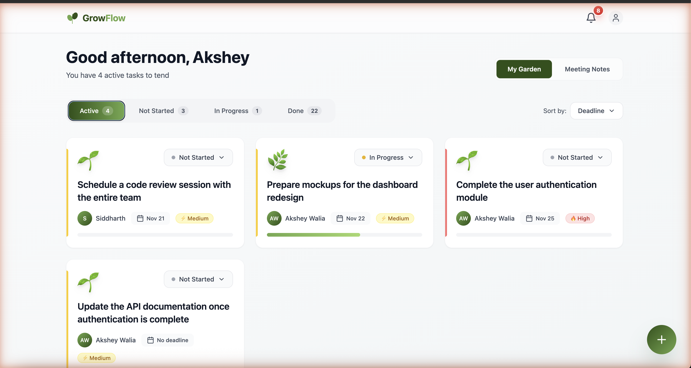
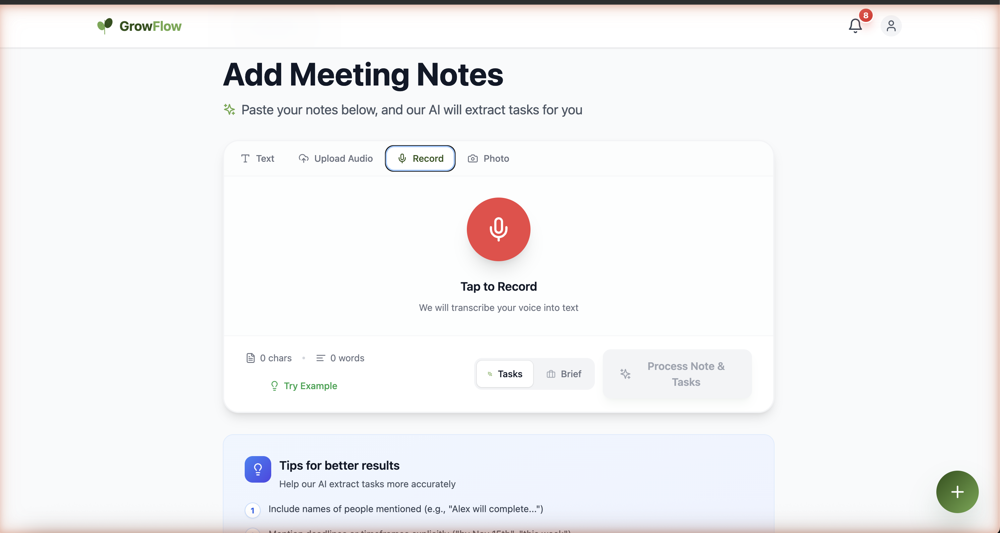
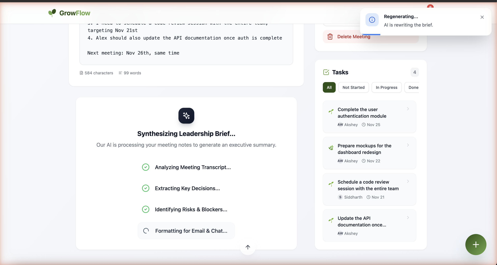
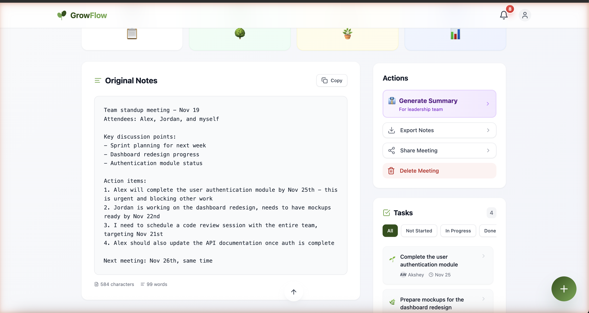
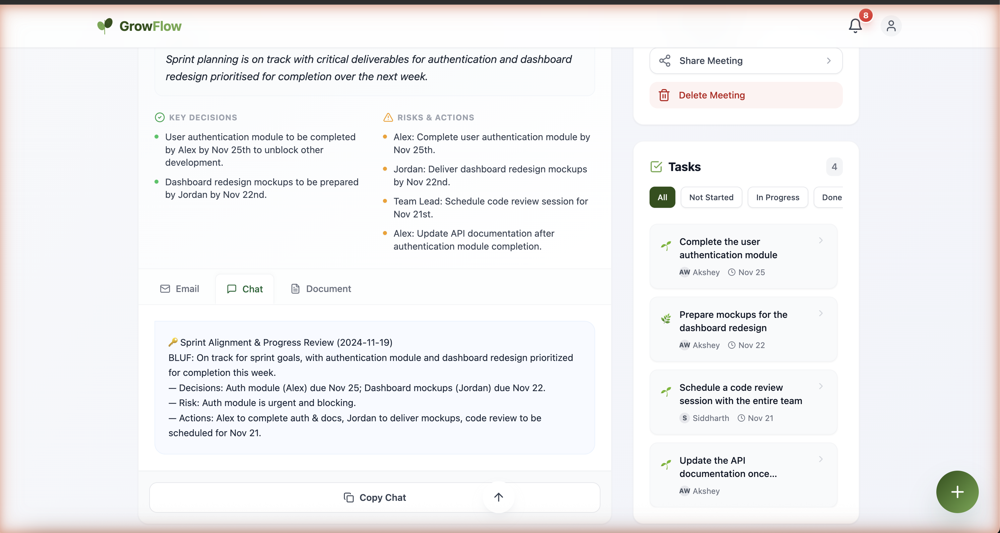

# 🌱 GrowFlowAI

> **Your meeting notes, turned into tasks that grow like plants.**

[](https://grow-flow-ai.vercel.app)
[](https://github.com/aksheyw/GrowFlowAI/actions/workflows/ci.yml)
[](LICENSE)

Forward a meeting note via Telegram, web, or email — AI extracts WHO does WHAT by WHEN, drops them into a Supabase task store, and visualises each task as a plant that grows the more you tend it. Every morning at 9am, the Telegram bot sends a digest with one-tap `✅ Done` / `⏰ Snooze` / `📅 Tomorrow` buttons.

<p align="center">
  <a href="https://grow-flow-ai.vercel.app">
    
  </a>
  <br>
  <em>The dashboard. Each task grows as you make progress on it.</em>
</p>

<p align="center">
  <a href="https://grow-flow-ai.vercel.app"><b>🚀 Try the live demo →</b></a>
</p>

---

## How the pipeline works

GrowFlowAI turns unstructured chaos (voice notes, meeting transcripts, whiteboard photos) into tracked tasks in seconds. Each step below is a real screenshot from the live app:

### 1. Multi-modal capture — paste, upload, record, or photo

<p align="center">
  
</p>

### 2. AI extraction in real time — watch the leadership brief get synthesised

<p align="center">
  
</p>

### 3. Meeting note → tasks — original notes left, AI-extracted tasks right

<p align="center">
  
</p>

### 4. Executive leadership brief — BLUF format with decisions, risks, actions

<p align="center">
  
</p>

---

## What makes it different

- ✅ **Lives where you already work** — Telegram-first, no new app to learn. Web + Android are convenience layers.
- ✅ **Zero structured input** — paste a transcript, forward an email, send a voice note. AI figures out the structure.
- ✅ **Plant metaphor with substance** — task status (`Not Started → In Progress → Done`) maps to plant growth stages; progress feels rewarding without being gimmicky.
- ✅ **Opinionated single-user build** — actively used daily, not a half-finished SaaS shell. RLS-enforced architecture means it's also ready for multi-tenancy when needed.
- ✅ **Production end-to-end** — web + Android (Capacitor) + Telegram bot (n8n) + AI processing (Supabase Edge Functions + Whisper/Vision/GPT-4o-mini).

---

## Capture surfaces (every one creates a structured task in seconds)

| Surface | Input | What happens |
|---------|-------|--------------|
| Telegram text | Plain message | LLM extracts tasks with assignee, deadline, priority |
| Telegram voice | Voice note | Whisper transcribes → LLM extracts tasks |
| Telegram photo | Photo of a whiteboard / sticky note | Vision OCR → LLM extracts tasks |
| Web app | Paste a meeting transcript | Same LLM pipeline + meeting summary + leadership brief |
| Email | Forward to the ingestion inbox | n8n parses → same pipeline |
| Voice rambling | Stream-of-consciousness recording | AI cleans it up, then extracts tasks |

**Output**

- A dashboard of tasks, each rendered as a plant whose growth stage tracks status (`Not Started → In Progress → Done`)
- A meeting note detail page with AI-generated 2–3 sentence summary, related tasks, and an exec-style leadership brief (TL;DR + decisions + action items in email/chat/document formats)
- "The Gardener" — chat-with-your-data RAG over all your past notes (pgvector embeddings, semantic search)
- Daily 9am Telegram digest of due/overdue tasks with one-tap action buttons
- Hybrid Google Calendar sync (tasks ↔ calendar events)

---

## Architecture

```
┌─────────────────────────────────────────────────────────────────┐
│  CAPTURE                                                         │
│  Telegram (text / voice / photo)   Web app   Email forwarding    │
└─────────────────────────────────────────────────────────────────┘
                              │
                              ▼
┌─────────────────────────────────────────────────────────────────┐
│  n8n on VPS                                                      │
│  – Whisper (voice) / Vision (photo) / direct (text)              │
│  – Sends `{user_id, note_text}` to Supabase Edge Function        │
└─────────────────────────────────────────────────────────────────┘
                              │
                              ▼
┌─────────────────────────────────────────────────────────────────┐
│  Supabase Edge Functions (Deno)                                  │
│  – process-ai-notes     LLM extracts WHO / WHAT / WHEN           │
│  – webhook-telegram-note Note ingestion entrypoint               │
│  – update-task-status   Auth-checked status updates              │
└─────────────────────────────────────────────────────────────────┘
                              │
                              ▼
┌─────────────────────────────────────────────────────────────────┐
│  Supabase Postgres (RLS-enforced)                                │
│  notes · tasks · task_details · profiles · notifications         │
│  + pgvector embeddings (Memory Maker → RAG)                      │
└─────────────────────────────────────────────────────────────────┘
                              │
              ┌───────────────┼───────────────┐
              ▼               ▼               ▼
     ┌──────────────┐  ┌──────────────┐  ┌──────────────┐
     │  React PWA   │  │  Telegram    │  │  Daily 9am   │
     │  + Capacitor │  │  bot replies │  │  digest job  │
     │  Android     │  │  (callbacks) │  │  (n8n cron)  │
     └──────────────┘  └──────────────┘  └──────────────┘
```

---

## Tech stack

| Layer | Choice | Why |
|-------|--------|-----|
| Frontend | **React 18 + Vite + TypeScript** | Fast dev loop, type safety, modern build |
| Styling | **Tailwind + Framer Motion** | Utility-first + buttery animations |
| State / data | **TanStack Query + Supabase Realtime** | Server-state + push updates with one library |
| Routing | **react-router 7** | Latest, file-style routes |
| Mobile | **Capacitor 7 + PWA** (`vite-plugin-pwa`) | One codebase, web + Android |
| Backend | **Supabase** (Auth + Postgres + Edge Functions + pgvector) | Single platform, RLS, Deno edge runtime |
| AI | **OpenAI GPT-4o-mini, Whisper, Vision** (via n8n) | Task extraction, voice transcription, OCR |
| Automation | **n8n on Hostinger VPS** | Visual flows for Telegram bot + email + cron |
| Quality | **TypeScript strict + ESLint** | Cheap safety net |

---

## Local setup

> Recruiters: feel free to skip this — the [code](src/), [edge functions](supabase/functions/), and [migrations](supabase/migrations/) are the interesting bits.

### Prerequisites
- Node 18+
- A Supabase project
- (Optional) OpenAI API key for AI task extraction in the edge function (falls back to a regex parser without it)
- (Optional) An n8n instance + Telegram bot for the full Telegram experience

### Steps

```bash
# 1. Clone and install
git clone https://github.com/aksheyw/GrowFlowAI.git
cd GrowFlowAI
npm install

# 2. Configure environment
cp .env.example .env
# Edit .env with your Supabase URL + anon key

# 3. Apply database schema (33 migrations)
npx supabase db push

# 4. Deploy edge functions
npx supabase functions deploy process-ai-notes
npx supabase functions deploy webhook-telegram-note
npx supabase functions deploy update-task-status

# 5. (Optional) Set OpenAI key for the edge function
npx supabase secrets set OPENAI_API_KEY=sk-...

# 6. Run
npm run dev
```

For the **Telegram bot** experience, see [`n8n/README.md`](n8n/README.md) — it walks through importing the sanitised workflow templates and wiring up your Telegram + Supabase + OpenAI credentials.

For the **Android** build:

```bash
npm run build
npx cap add android        # first time only
npx cap sync android
npx cap open android       # opens Android Studio
```

---

## Project structure

```
src/
├── components/        UI components (cards, modals, layout, theme)
│   ├── meeting-note/    Meeting detail UI (summary, tasks, leadership brief)
│   ├── notes/           Note editor + media input (voice / photo)
│   ├── premium/         Premium dashboard widgets
│   ├── task-detail/     Task hero plant + activity timeline
│   └── ui/              Atoms (Button, Card, DatePicker, Select, ...)
├── contexts/          AuthContext, ThemeContext, ToastContext
├── hooks/             React Query hooks (useTasks, useNotifications, ...)
├── lib/               Supabase client, API helpers, type defs
├── pages/             Route components (Dashboard, TaskDetail, AddNote, ...)
├── types/             Shared TypeScript types
└── utils/             Audio compression, premium helpers, text analysis

supabase/
├── functions/         3 Deno edge functions
└── migrations/        33 SQL migrations (schema, RLS policies, indexes)

n8n/                   Telegram bot workflow exports (sanitised)
Docs/                  ROADMAP.md, SKILLS.md
```

---

## Why I built this

I spend most of my day in meetings, and most action items I commit to in those meetings end up forgotten — buried under notes I never re-read. I wanted something that:

- Lived where I already work (Telegram, mostly)
- Required zero structured input (paste a transcript, forward an email, send a voice note — that's it)
- Made progress feel rewarding without being gimmicky (hence the plant metaphor — tasks visibly grow as you make progress on them)

I built it as a side-project to push myself end-to-end on a real product: web + Android (via Capacitor) + a Telegram bot orchestrated through n8n + AI processing on Supabase Edge Functions. It is opinionated, single-user, and actively in use.

---

## Status

Personal project, actively developed. Used daily by me. Not multi-tenant yet — single-user model with RLS. See [`Docs/ROADMAP.md`](Docs/ROADMAP.md) for what's built vs. what's planned.

## License

[MIT](LICENSE) © 2026 Akshey Walia

---

<div align="center">

**Built by [Akshey Walia](https://www.linkedin.com/in/aksheywalia/)** · [LinkedIn](https://www.linkedin.com/in/aksheywalia/) · [aksheywalia.in](https://aksheywalia.in)

*Director-level Product Manager. I build products that ship.*

</div>
